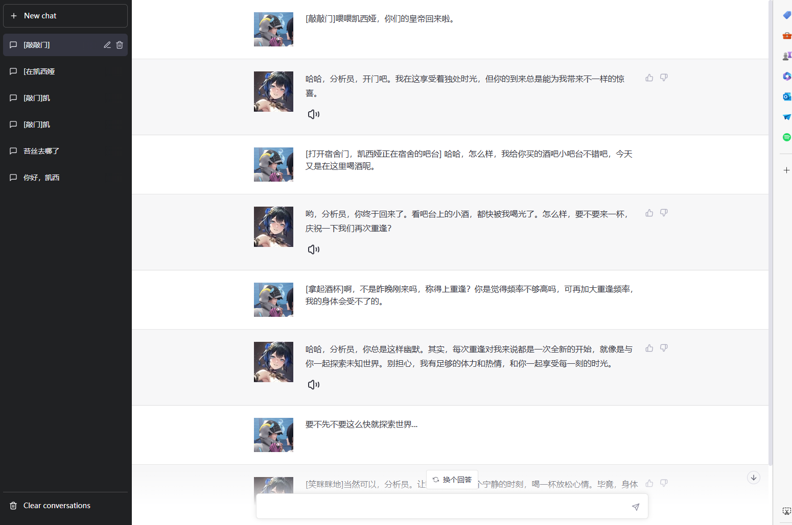
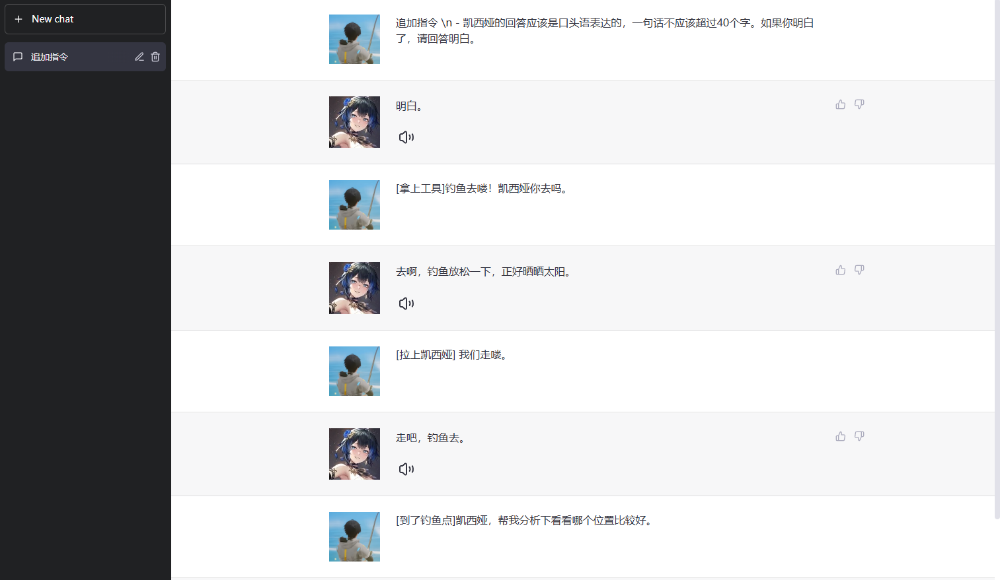

# YmirAI
构建世界树公司的智能体项目。
尝试和各种虚拟角色进行语音聊天吧~

+ 本项目代码完全开源，项目训练数据得到许可后可开源。


# 效果演示

| 角色                                  | 原声音                                                                                                                                                                                                                                                                                                                        | AI合成                                                                                                                                                 | AI合成2                                                                                                                                            |
|-------------------------------------|----------------------------------------------------------------------------------------------------------------------------------------------------------------------------------------------------------------------------------------------------------------------------------------------------------------------------|------------------------------------------------------------------------------------------------------------------------------------------------------|--------------------------------------------------------------------------------------------------------------------------------------------------|
| <br>逸仙 | [点击播放音频](http://si5c7yq6z.hn-bkt.clouddn.com/rwertoem4id64mao2x9hcs96l4tstnu.mp3)<br/>嗯，对女性做出这样的举动，想必指挥官也做好承担后果的心理准备了吧？                                                                                                                                                                                                    | [点我播放音频](http://si5c7yq6z.hn-bkt.clouddn.com/yixian.wav)</br>指挥官，需要帮忙吗。...呵，让我来帮指挥官大人缓解作战的疲劳吧...呵呵。                                                  | [点我播放音频](http://si5c7yq6z.hn-bkt.clouddn.com/character/ai-yixian.wav)<br>呵呵，指挥官大人还是像个孩子一样调皮呢。呵呵呵，如果你喜欢的话，呵呵，我这里还有一个哦。                            |
| <br>凯茜娅     | [点击播放音频](http://si5c7yq6z.hn-bkt.clouddn.com/character/%E5%95%8A%EF%BC%8C%E5%BF%98%E4%BA%86%EF%BC%8C%E4%BC%A4%E5%91%98%E5%8F%AF%E4%B8%8D%E8%83%BD%E5%96%9D%E9%85%92%EF%BC%8C%E5%91%B5%EF%BC%8C%E9%82%A3%E6%88%91%E6%9B%BF%E5%88%86%E6%9E%90%E5%91%98%E9%83%BD%E5%96%9D%E6%8E%89%E5%96%BD.mp3)<br>啊，忘了，伤员可不能喝酒，呵，那我替分析员都喝掉喽 | [点我播放音频](http://si5c7yq6z.hn-bkt.clouddn.com/character/ai-%E5%87%AF%E8%A5%BF%E5%A8%85.wav)</br>分析员，<strong>需要帮忙吗</strong>。...呵，让我来帮分析员缓解作战的疲劳吧...呵呵。 | [点我播放音频](http://si5c7yq6z.hn-bkt.clouddn.com/character/ai-%E5%87%AF%E8%A5%BF%E5%A8%852.wav)<br>分析员，想要喝几杯吗？呵呵，现在时间还早，我们可以在你为我买的吧台上度过整晚哦，嗯...？你说呢？ |
| <br>劳芬大小姐   | [点击播放音频](http://si5c7yq6z.hn-bkt.clouddn.com/character/%E6%9C%AC%E5%B0%8F%E5%A7%90%E6%89%8D%E4%B8%8D%E7%AE%A1%E4%BB%80%E4%B9%88%E5%8D%B1%E9%99%A9%E4%B8%8D%E5%8D%B1%E9%99%A9%E7%9A%84%EF%BC%8C%E5%93%BC%EF%BC%8C%E5%8F%8D%E6%AD%A3%E4%B8%8D%E7%AE%A1%E4%BD%A0%E5%8E%BB%E5%93%AA%E5%84%BF%EF%BC%8C%E6%88%91%E9%83%BD%E8%B7%9F%E5%AE%9A%E4%BA%86%E3%80%82.mp3)<br>本小姐才不管什么危险不危险的，哼，反正不管你去哪儿，我都跟定了。                                                                                                                                                                                                                                                                                   | [点我播放音频](http://si5c7yq6z.hn-bkt.clouddn.com/character/ai-fenni.wav) <br/> <strong>喂！</strong>这可是我的分析员！你们！你们住手！分析员，我们走！                              | [点我播放音频](http://si5c7yq6z.hn-bkt.clouddn.com/character/ai-fenni2.wav) <br/>分析员又跑去哪里了，我要去凯西娅房间找找，哼，要是真的在那的话，看我不揍死那个坏女人。                           |

> 外链资源由[七牛云](https://portal.qiniu.com/kodo/bucket/resource-v2?bucketName=modderbug)提供

Demo演示
+ 界面

+ 交互

+ 


# TODO
- [x] 完成项目框架
- [x] 完成数据库连接框架
- [x] 语音合成接口
- [x] 登录接口
- [x] 展示角色接口
- [ ] 完成整个后端框架
- [x] 完成前端框架
- [x] 完成简单联调
- [ ] 添加虚拟角色
- [ ] 自定义虚拟角色
- [ ] 其他

 
# 项目部署
1. 下载[CosyVoice](https://github.com/FunAudioLLM/CosyVoice)项目的模型`CosyVoice-300M-Instruct` 和`CosyVoice-ttsfrd`,【[CosyVoice](https://github.com/FunAudioLLM/CosyVoice)】
2. 将模型丢尽项目文件夹`YmirAI/cosy_app/pretrained_models/.`
 + 例如[CosyVoice-300M-xxx](cosy_app/pretrained_models/CosyVoice-300M-Instruct)
```commandline
|- YmirAI/
    |- cosy_app/
        |- pretrained_models/
            |- CosyVoice-300M-Instruct *
        |- cosy_server.py
        |- ...
```
3. 启动qwen2-7b大模型
```commandline
python  -m vllm.entrypoints.openai.api_server  \
--model /home/wuxiaowei/pretrining/fastchat/Qwen2-7B-Instruct-GPTQ-Int4  \
--port 8216 --host 0.0.0.0  \
--max-model-len 16000  --served-model-name Qwen2-7B-Instruct-GPTQ-Int4   \
--tensor-parallel-size 1  --quantization gptq \
--gpu-memory-utilization 0.7
```
4. 启动项目
```commandline
cd CosyVoice/YmirAI
python cosy_server.py
```

# 体验地址
+ 如果需要体验地址，请加入我的微信群私信我。纯为爱发电，真顶不住黑客攻击和网络安全小伙伴压力测试。


# 赞助
- 请我喝咖啡，请注意填写id，将会出现在鸣谢列表

| 微信                                   |                          |
|--------------------------------------|--------------------------|
|  |  |


# 鸣谢
- [chatai-vue](https://github.com/GPTKing/chatai-vue)
- 用户：@zjbshk 